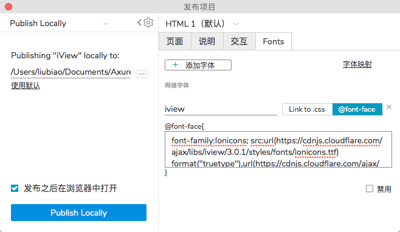

# Introduction 使用说明 (Axure RP9)

演示：[iViewAxureLib](https://www.wulihub.com.cn/go/JYo8B4/start.html)

### 概述

iView 是一个很棒的前端开源框架，具备良好的用户体验，深受广大开发的喜爱。

为了方便在项目的初期规划过程中，能够更直观的体现出项目结果，所以我尝试做了这个Axure组件框架，来方便在制作原型时使用。

#### 免费且开源

本组件库将会发布在github上，会不定期更新版本：https://github.com/huarxia/iViewAxureLib

下载: https://github.com/huarxia/iViewAxureLib/releases

元件库将永远保持免费与开源，遵循GPL-V3协议，希望能为大家做出一些贡献。`特别提醒：本官方元件库不收取任何费用，请认准官方提供下载链接。`

#### 预览之前

由于组件库使用了特定的字体和图标，如果您的电脑中没有安装对于的字体，会出现大量的显示错乱和问号；图标来源于开源项目。

请在开始之前先下载字体文件 [IONICON](http://oos.animaui.com/mini/fonts/ionicons.ttf)

#### 输出预览文件

> 由于字体文件使用的cloudflare，部分用户可能会遇到加载失败或加载耗时较长的情况。 [ionicons](https://www.ionicons.com/)

```css
font-family:Ionicons; src:url(https://cdnjs.cloudflare.com/ajax/libs/iview/3.0.1/styles/fonts/ionicons.ttf) format("truetype"),url(https://cdnjs.cloudflare.com/ajax/libs/iview/3.0.1/styles/fonts/ionicons.woff) format("woff"),url(https://cdnjs.cloudflare.com/ajax/libs/iview/3.0.1/styles/fonts/ionicons.svg#Ionicons) format("svg"); font-weight:400; font-style:normal
```


#### 关于 iView

> iView 是一套基于 Vue.js 的开源 UI 组件库，主要服务于 PC 界面的中后台产品。

特性：

• 高质量、功能丰富

• 友好的 API ，自由灵活地使用空间

• 细致、漂亮的 UI

• 事无巨细的文档

• 可自定义主题

[点此访问项目地址](https://www.iviewui.com/docs/introduce)

#### 关于设计与文案

为了保证原型的实现效果，组件库中使用的所有组件都是按照iView项目的设计进行实现；

库中的文案很多也是沿用了官方文档中的说明，以保证高保真的使用；

所有的UI设计和文案版权都归属于iView团队，感谢他们的精心制作。

### 捐赠与联系

> 如果大家确实很喜欢这个iview元件库，可以打赏支持支持，谢谢大家。如果想与我取得联系请加微信(以下二维码为AnimaUI作者所有并非第三方修改)


#### 其他相关

> 另外还有小程序前端UI库，欢迎查看使用


